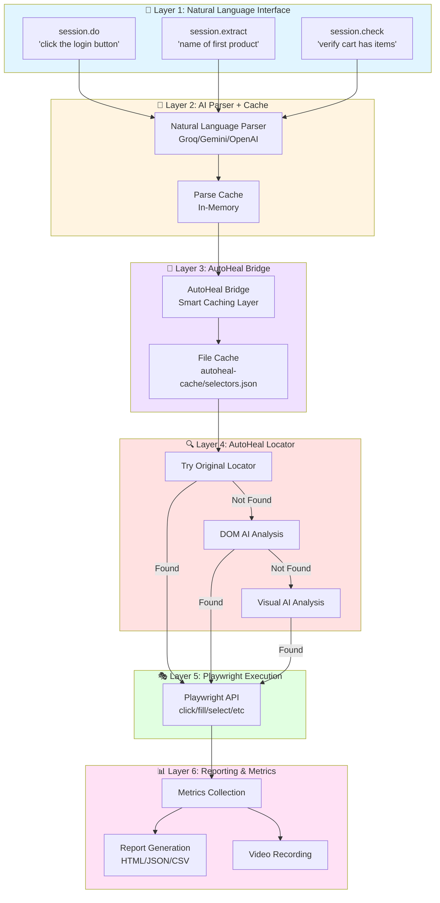
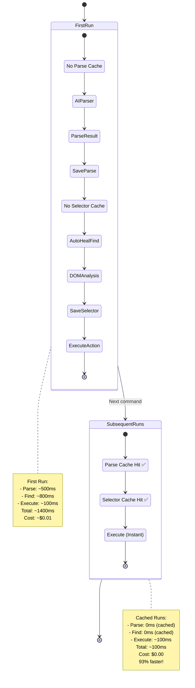
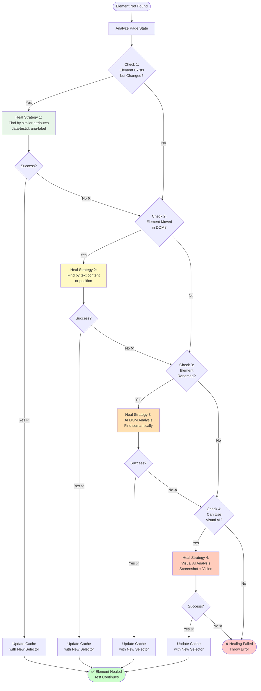
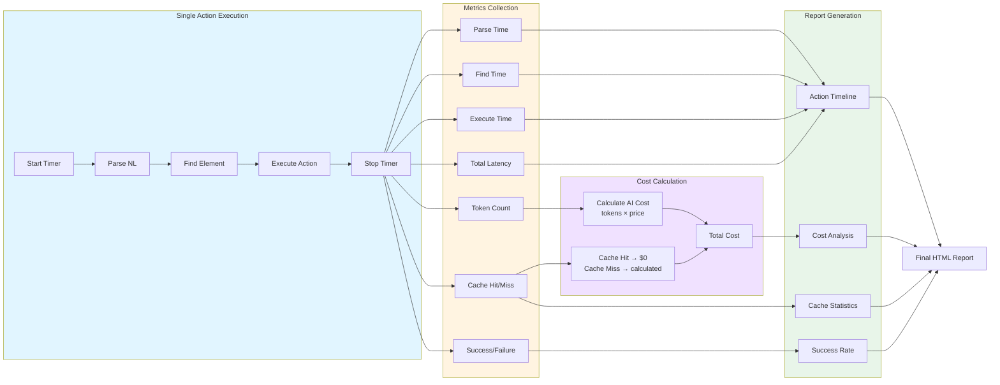
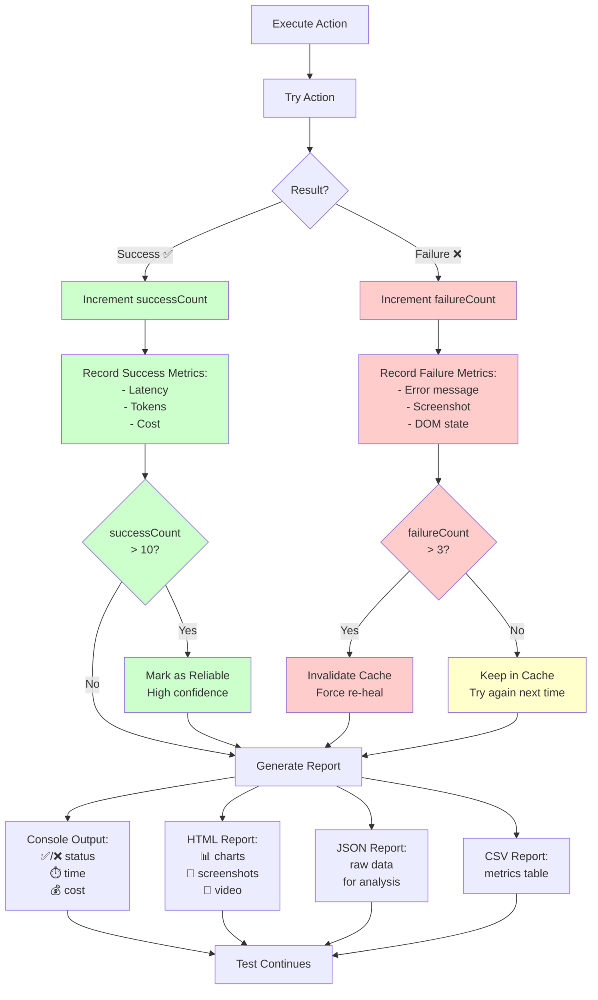
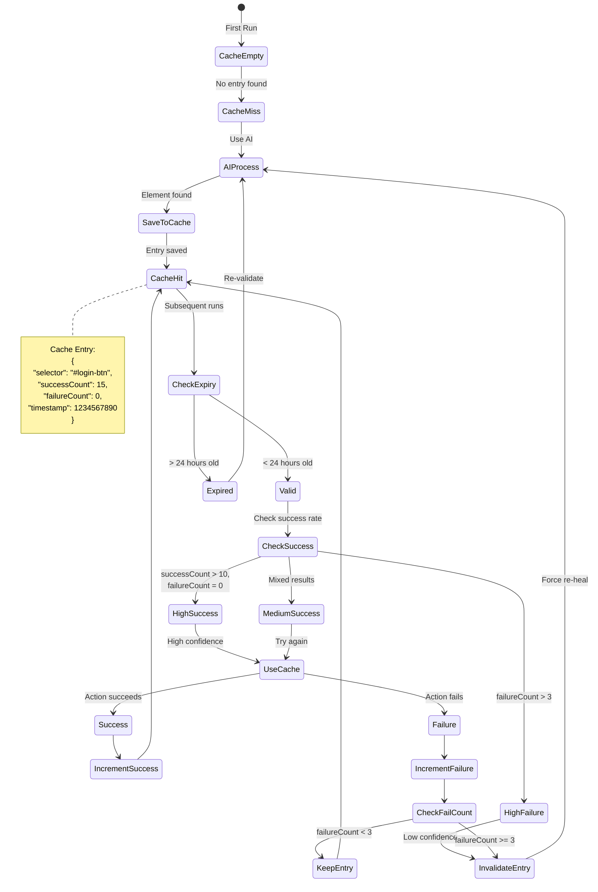
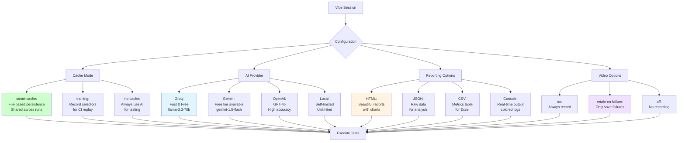

# Vibe Framework Architecture - Complete End-to-End Flow 🔄

Complete visual explanation of how Vibe Framework works internally, from natural language input to reporting.

---

## 🎯 Complete Healing Mechanism Flow

This diagram shows the entire journey of a natural language command through the Vibe Framework:

```mermaid
flowchart TD
    Start([User writes Natural Language Command]) --> Input["session.do('click the login button')"]

    Input --> ParseCache{Parse Cache<br/>Exists?}

    ParseCache -->|Cache Hit| ParseCached[Load Parsed Command<br/>from Cache<br/>⚡ Instant]
    ParseCache -->|Cache Miss| ParseAI[AI Natural Language Parser<br/>Groq/Gemini/OpenAI<br/>~500ms]

    ParseAI --> ParseResult[Parse Result:<br/>Action: click<br/>Element: login button<br/>Type: button]
    ParseResult --> SaveParse[Save to Parse Cache<br/>for next time]
    SaveParse --> ParseCached

    ParseCached --> SelectorCache{Selector Cache<br/>autoheal-cache/<br/>selectors.json<br/>Exists?}

    SelectorCache -->|Cache Hit ✅| CachedSelector["Retrieved from Cache:<br/>button|login button<br/>→ #login-button<br/>⚡ ~100ms<br/>💰 $0"]
    SelectorCache -->|Cache Miss ❌| AutoHeal[AutoHeal Element Finder<br/>AI-Powered]

    AutoHeal --> TryOriginal{Try Original<br/>Locator First}
    TryOriginal -->|Found ✅| OriginalWorks[Original Locator Works!<br/>e.g., button found]
    TryOriginal -->|Not Found ❌| DOMAnalysis[AI DOM Analysis<br/>Scan page structure<br/>~800ms]

    OriginalWorks --> SaveToCache

    DOMAnalysis --> AIFind{AI Found<br/>Element?}
    AIFind -->|Yes ✅| ElementFound[Element Located:<br/>#login-button<br/>💰 ~$0.01]
    AIFind -->|No ❌| VisualAI[Visual AI Analysis<br/>Screenshot + Vision AI<br/>~2000ms<br/>💰 ~$0.03]

    VisualAI --> VisualFound{Visual AI<br/>Found?}
    VisualFound -->|Yes ✅| ElementFound
    VisualFound -->|No ❌| ElementFailed[Element Not Found<br/>❌ Healing Failed]

    ElementFound --> SaveToCache[Save to Cache:<br/>button|login button<br/>→ #login-button<br/>successCount: 1]

    SaveToCache --> CachedSelector

    CachedSelector --> ExecuteAction[Execute Playwright Action:<br/>page.locator('#login-button').click]

    ExecuteAction --> ActionResult{Action<br/>Successful?}

    ActionResult -->|Success ✅| IncrementSuccess[Increment successCount<br/>in cache]
    ActionResult -->|Failure ❌| IncrementFailure[Increment failureCount<br/>in cache]

    IncrementSuccess --> RecordMetrics[Record Metrics:<br/>- Latency time<br/>- Token count<br/>- Cost estimate<br/>- Cache hit/miss]
    IncrementFailure --> CheckFailCount{failureCount<br/>> threshold?}

    CheckFailCount -->|Yes| InvalidateCache[Invalidate Cache Entry<br/>Force re-heal next time]
    CheckFailCount -->|No| RecordMetrics

    InvalidateCache --> RecordMetrics

    RecordMetrics --> GenerateReport[Generate Test Report:<br/>- HTML Report<br/>- JSON Report<br/>- CSV Report<br/>- Console Output]

    GenerateReport --> AttachArtifacts{Include<br/>Artifacts?}

    AttachArtifacts -->|Yes| AddScreenshot[Add Screenshot<br/>to Report]
    AttachArtifacts -->|No| FinalReport

    AddScreenshot --> AddVideo{Video<br/>Recording?}
    AddVideo -->|Yes| EmbedVideo[Embed Video<br/>in Report]
    AddVideo -->|No| FinalReport

    EmbedVideo --> FinalReport[Final Report with:<br/>✅ Action status<br/>⏱️ Performance metrics<br/>💰 Cost analysis<br/>📊 Cache statistics<br/>📸 Screenshots<br/>🎥 Video]

    FinalReport --> SessionSummary[Update Session Summary:<br/>- Total actions<br/>- Success/fail counts<br/>- Cache hit rate<br/>- Total cost<br/>- Total time]

    SessionSummary --> End([Command Complete<br/>Ready for Next Action])

    ElementFailed --> ErrorReport[Generate Error Report:<br/>- Element description<br/>- Page screenshot<br/>- DOM snapshot<br/>- Suggestions]
    ErrorReport --> ThrowError[Throw Error to Test<br/>❌ Test Failed]
    ThrowError --> SessionSummary

    %% Styling
    style Start fill:#e1f5ff
    style End fill:#e1f5ff
    style ParseCached fill:#ccffcc
    style CachedSelector fill:#ccffcc
    style SaveToCache fill:#ccffcc
    style IncrementSuccess fill:#ccffcc
    style ElementFound fill:#ccffcc
    style ParseAI fill:#fff4cc
    style AutoHeal fill:#fff4cc
    style DOMAnalysis fill:#fff4cc
    style VisualAI fill:#ffebcc
    style ElementFailed fill:#ffcccc
    style ThrowError fill:#ffcccc
    style IncrementFailure fill:#ffcccc
    style FinalReport fill:#e8f5e9
    style GenerateReport fill:#e8f5e9
```

---

## 📊 Layer-by-Layer Architecture



---

## ⚡ Cache Performance Flow



---

## 🔄 AutoHeal Self-Healing Process



---

## 📈 Performance Metrics Flow



---

## 🎯 Success vs Failure Paths



---

## 💾 Cache Management



---

## 🔧 Configuration & Modes



---

## Summary

These diagrams show:
1. ✅ **Complete end-to-end flow** - From NL input to reporting
2. ✅ **Layer-by-layer architecture** - 6 distinct layers
3. ✅ **Cache performance** - First run vs cached runs
4. ✅ **AutoHeal healing process** - 4 healing strategies
5. ✅ **Performance metrics** - How metrics are collected
6. ✅ **Success vs failure paths** - Different outcomes
7. ✅ **Cache management** - Lifecycle and invalidation
8. ✅ **Configuration modes** - All available options

**Result**: Complete visual understanding of the entire framework! 📊
