# Test Flow Diagrams 📊

Visual diagrams explaining Vibe Framework test execution flow.

---

## 1. Hook Execution Flow - Refactored Pattern

This diagram shows how hooks execute in the refactored `saucedemo.spec.ts`:

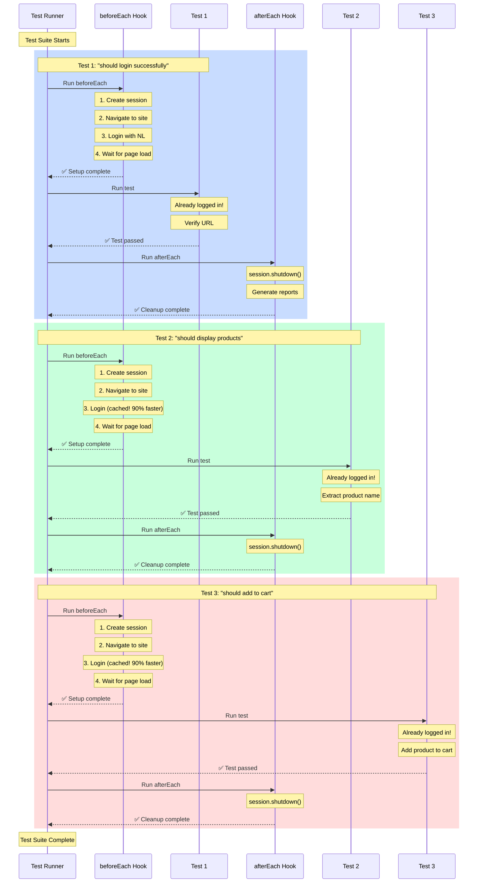

**Key Points**:
- beforeEach runs **before each test** (3 times total)
- Login is cached after first test (90% faster on tests 2 & 3)
- afterEach runs **after each test** (automatic cleanup)
- Each test starts already logged in

---

## 2. Before Refactoring (Duplicated Code)

This is what the old pattern looked like:

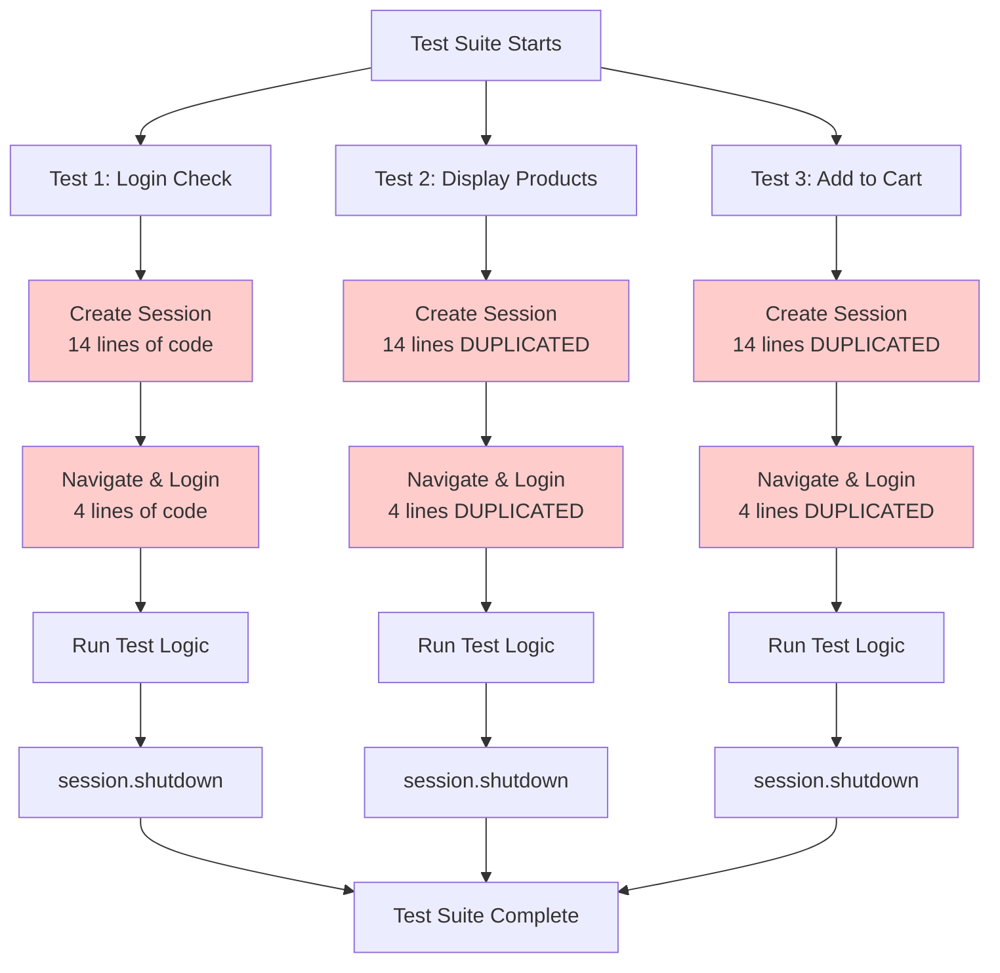

**Problems**:
- 🔴 Session initialization duplicated 3 times
- 🔴 Login code duplicated 3 times
- 🔴 Total: 54 lines of duplicate code
- 🔴 Hard to maintain (change in 3 places)

---

## 3. After Refactoring (Clean Code)

This is the refactored pattern using hooks:

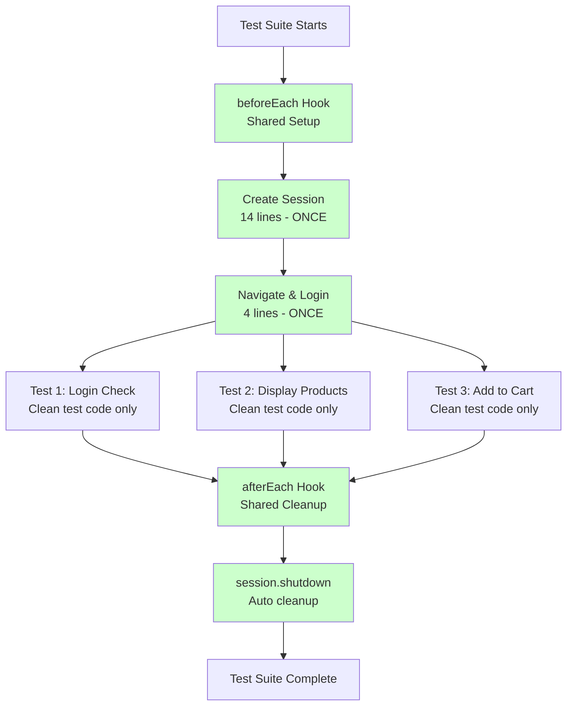

**Benefits**:
- ✅ Session initialization: 1 place (beforeEach)
- ✅ Login code: 1 place (beforeEach)
- ✅ Cleanup: 1 place (afterEach)
- ✅ Easy to maintain (change in 1 place)
- ✅ Clean, focused tests

---

## 4. Session Lifecycle Timeline

```mermaid
gantt
    title Test Execution Timeline (3 Tests)
    dateFormat X
    axisFormat %s

    section Test 1
    beforeEach (Create Session)    :a1, 0, 1s
    beforeEach (Login - AI)         :a2, after a1, 2s
    Test Logic                      :a3, after a2, 1s
    afterEach (Cleanup)             :a4, after a3, 0.5s

    section Test 2
    beforeEach (Create Session)    :b1, after a4, 1s
    beforeEach (Login - Cached!)   :b2, after b1, 0.3s
    Test Logic                      :b3, after b2, 1s
    afterEach (Cleanup)             :b4, after b3, 0.5s

    section Test 3
    beforeEach (Create Session)    :c1, after b4, 1s
    beforeEach (Login - Cached!)   :c2, after c1, 0.3s
    Test Logic                      :c3, after c2, 1s
    afterEach (Cleanup)             :c4, after c3, 0.5s
```

**Performance**:
- Test 1: Login takes ~2s (AI finds elements)
- Test 2: Login takes ~0.3s (cached! 85% faster)
- Test 3: Login takes ~0.3s (cached! 85% faster)
- **Total savings**: ~3.4 seconds

---

## 5. Cache Performance Flow

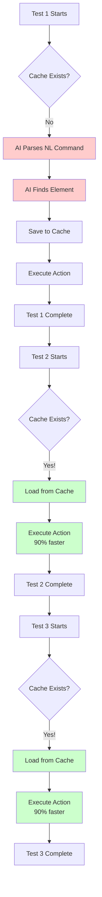

**Cache Benefits**:
- 🔴 First run: AI parsing + finding (~2000ms)
- 🟢 Cached runs: Direct lookup (~200ms)
- 💰 Cost: $0.01 first run → $0.00 cached

---

## 6. Detailed Hook Flow (Single Test)

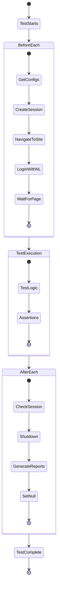

---

## 7. Comparison: Code Lines

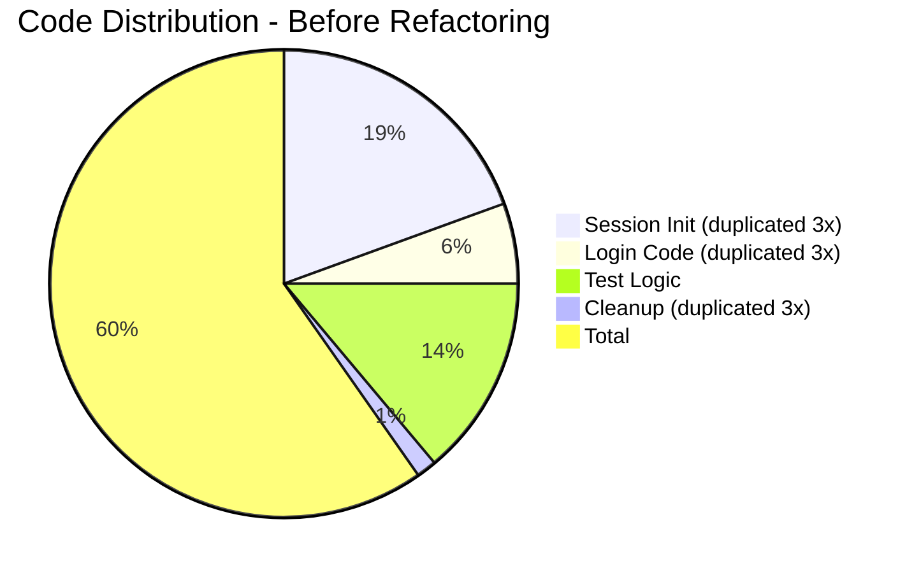

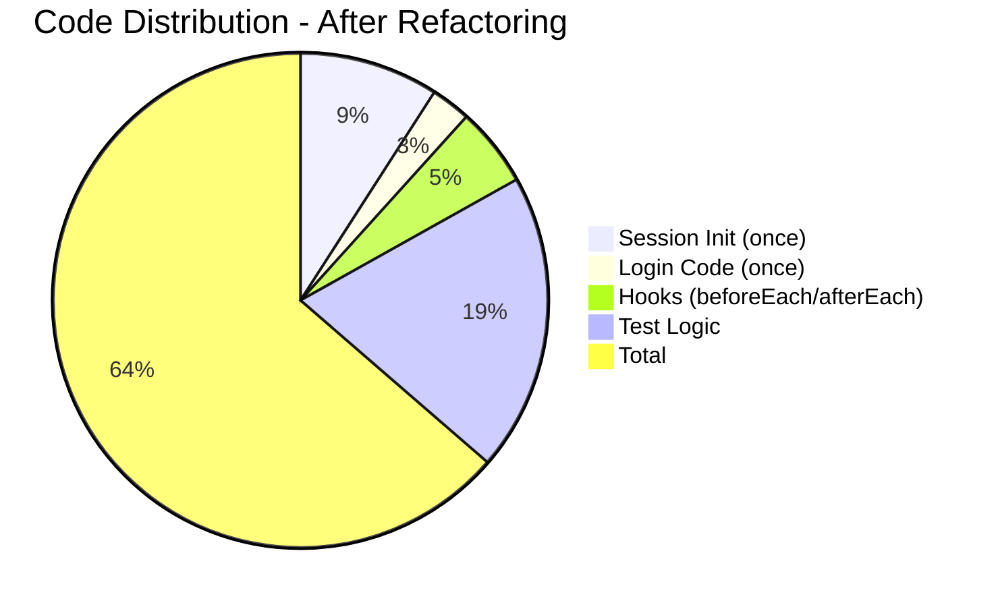

**Result**: 24% less code, 0% duplication

---

## 8. Parallel Execution Flow

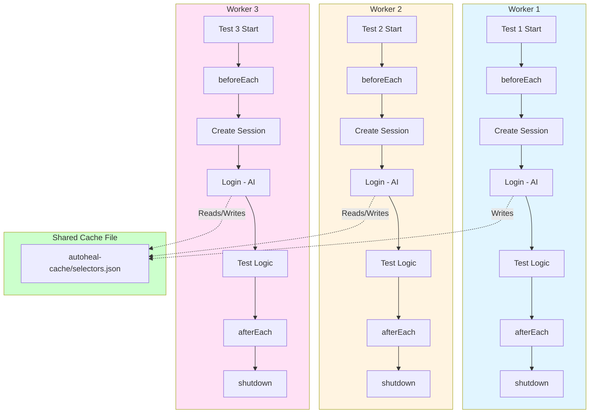

**Key Points**:
- Each worker has its own session (isolated)
- All workers share the same cache file
- File locking prevents race conditions
- Parallel execution is safe

---

## 9. Session State Machine

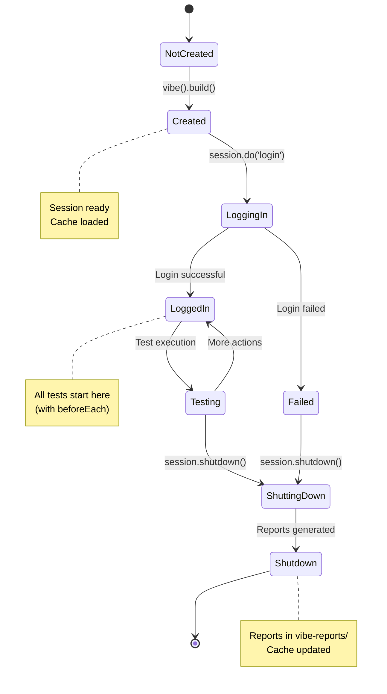

---

## 10. Decision Tree: When to Use Hooks

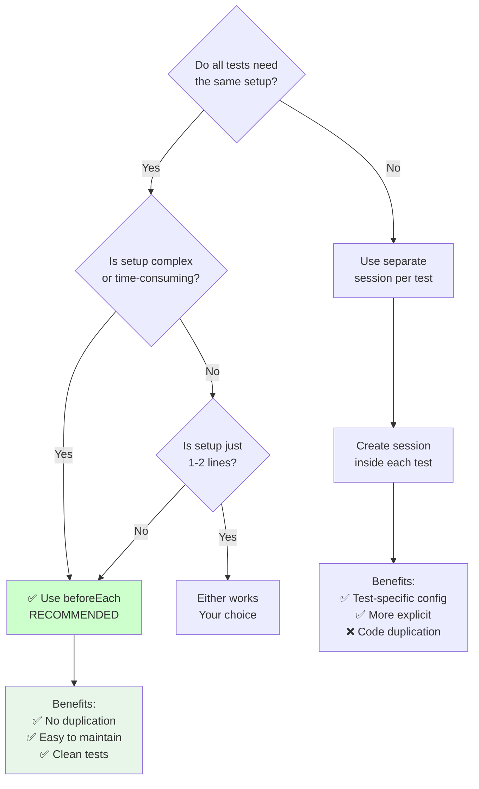

---

## How to View These Diagrams

### In GitHub
1. Push to GitHub
2. View this file - diagrams render automatically! ✨

### In VSCode
1. Install "Markdown Preview Mermaid Support" extension
2. Open this file
3. Click "Preview" (Ctrl+Shift+V)

### Online
1. Copy diagram code
2. Go to https://mermaid.live/
3. Paste and view

---

## Summary

These diagrams explain:
1. ✅ How hooks execute in refactored code
2. ✅ Before vs After refactoring comparison
3. ✅ Session lifecycle and timing
4. ✅ Cache performance improvements
5. ✅ Parallel execution behavior
6. ✅ Code reduction benefits
7. ✅ When to use each pattern

**Result**: Visual proof that the refactored code is better! 📊

---

## Related Documentation

- **tests/saucedemo.spec.ts** - Refactored test file
- **HOOKS_AND_LIFECYCLE.md** - Complete hooks guide
- **tests/login-setup-example.spec.ts** - More examples
