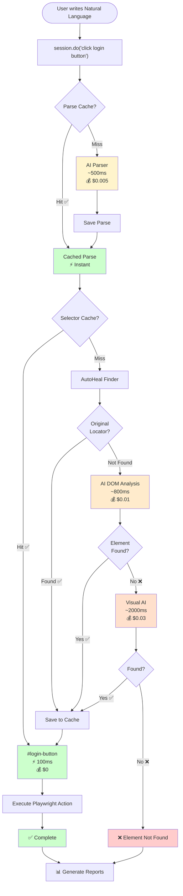

# Vibe Framework Demo 🎯

Demo project showcasing [@sdetsanjay/vibe-framework](https://www.npmjs.com/package/@sdetsanjay/vibe-framework) (v1.1.3) and [@sdetsanjay/autoheal-locator](https://www.npmjs.com/package/@sdetsanjay/autoheal-locator) (v1.1.4) - write test automation in natural language with Playwright.

## 📑 Table of Contents

- [What is Vibe Framework?](#what-is-vibe-framework)
- [Architecture](#️-architecture)
- [Features](#features)
- [Installation](#installation)
- [How to Run Tests](#-how-to-run-tests) ⭐ **Start Here**
- [Configuration](#configuration)
- [Hybrid Approach](#-hybrid-approach) (Recommended)
- [Advanced Features](#advanced-features)
  - [Hooks & Lifecycle](#-hooks--lifecycle)
  - [Advanced Elements](#-advanced-elements)
  - [Parallel Testing](#-parallel-testing)
  - [Smart Caching & Training Mode](#-smart-caching--training-mode)
- [Reports & Results](#-reports--results)
- [Troubleshooting](#troubleshooting)
- [Documentation](#documentation)

---

## What is Vibe Framework?

Vibe Framework lets you write test commands in plain English.

```typescript
await session.do('click the login button');
await session.do('type hello@example.com into email field');
await session.check('verify dashboard is loaded');
```

**Best Part?** You can **freely mix Playwright with natural language**:

```typescript
// Use Playwright for what it's good at
await page.goto('https://app.com');
await page.getByRole('textbox', { name: 'username' }).fill('john');

// Use Natural Language for dynamic elements
await session.do('click the login button');

// Use Playwright for assertions
expect(page.url()).toContain('dashboard');
```

Built on [@sdetsanjay/autoheal-locator](https://www.npmjs.com/package/@sdetsanjay/autoheal-locator) with intelligent element detection and self-healing.

### 🆕 Latest Updates (March 14, 2026)

**vibe-framework@1.1.3** - Token Tracking & Cost Reporting
- ✅ Real-time AI token usage tracking
- ✅ Accurate cost calculation per action
- ✅ Token counts in JSON/HTML reports
- ✅ Provider-specific cost models

**autoheal-locator@1.1.4** - Gemini Model Update
- ✅ Updated to `gemini-2.5-flash` (from deprecated `gemini-2.0-flash-exp`)
- ✅ Fixes 404 errors with Gemini API
- ✅ Better JSON response reliability

**Configuration Improvements**
- ✅ Automatic API key selection based on provider
- ✅ Clear mandatory vs optional settings in `.env.example`
- ✅ No patches needed - all fixes in official packages

---

## 🏗️ Architecture

### How It Works - Smart Caching & Self-Healing



**Key Points**:
- 🎯 **Smart Caching**: 93% faster after first run, $0 cost
- 🔧 **Self-Healing**: 4-level healing (Original → DOM AI → Visual AI)
- 📊 **Auto Reporting**: HTML/JSON/CSV with videos & screenshots
- 💰 **Cost Tracking**: Real-time cost analysis per action
- ⚡ **Performance**: First run ~1.4s → Cached ~0.1s

**See complete architecture**: [ARCHITECTURE_FLOW.md](./ARCHITECTURE_FLOW.md)

---

## Features

- ✅ **Natural language automation** - Write commands in plain English
- ✅ **Hybrid approach** - Mix Playwright + Natural Language freely (recommended)
- ✅ **Multiple AI providers** - Groq, Gemini, OpenAI, DeepSeek, Anthropic, Local
- ✅ **Smart caching** - 95-99% latency reduction after first run
- ✅ **Training mode** - Zero-cost CI/CD runs
- ✅ **Beautiful reporting** - HTML reports with screenshots, videos, token tracking
- ✅ **Parallel execution** - Thread-safe, 2.5x-3.5x speedup
- ✅ **Self-healing** - Automatic element recovery
- ✅ **Advanced elements** - Select boxes, alerts, window switching
- ✅ **Cost analysis** - Real-time AI cost tracking per action

---

## Installation

### Prerequisites
- Node.js 16 or higher
- npm (comes with Node.js)

### Steps

1. **Clone this repository:**
```bash
git clone https://github.com/SanjayPG/vibe-framework-demo.git
cd vibe-framework-demo
```

2. **Install dependencies:**
```bash
npm install
```

This installs:
- `@sdetsanjay/vibe-framework@1.1.3` - Latest with token tracking
- `@sdetsanjay/autoheal-locator@1.1.4` - Latest with Gemini 2.5 Flash
- All fixes included, no patches needed!

3. **Install Playwright browsers:**
```bash
npx playwright install
```

4. **Configure API key:**
```bash
# Copy the example environment file
cp .env.example .env

# Edit .env and add your API key
# The .env.example file clearly marks what's required (🟢 MANDATORY) vs optional (🔵 OPTIONAL)

# Only 2 things are mandatory:
GROQ_API_KEY=your-groq-api-key-here     # 🟢 MANDATORY: At least one API key
VIBE_AI_PROVIDER=GROQ                   # 🟢 MANDATORY: Select your provider

# Everything else has smart defaults! (video recording, reports, etc.)
```

**Get API Keys:**
- **Groq** (Recommended - Fast & Free): https://console.groq.com/
- **Gemini** (Free Tier): https://aistudio.google.com/app/apikey
- **OpenAI** (Paid): https://platform.openai.com/api-keys

**Note:** The `.env.example` file documents all settings with clear mandatory/optional markers and default values!

---

## 🚀 How to Run Tests

Choose between automated or manual workflow:

### Option 1: Use test-and-view.js (Recommended) ✅

Run this **INSTEAD** of manual test commands:

```bash
# Using npm script (easiest)
npm run test:view

# Or with specific test file
node utilities/test-and-view.js tests/saucedemo.spec.ts

# Or with specific test line
node utilities/test-and-view.js tests/saucedemo.spec.ts:56
```

**This does everything:**
- 🧹 Cleans old reports
- 🧪 Runs the test
- 📊 Generates unified report
- 🌐 Opens it automatically

**Don't run any manual test commands - just use this script!**

---

### Option 2: Manual Testing (if you prefer)

If you want to run tests manually with `npx playwright test`, follow this pattern:

```bash
# Step 1: Clean reports first
npm run clean:all

# Step 2: Run your test manually
npm test                                   # All tests
npx playwright test tests/file.spec.ts     # Specific test
npx playwright test tests/file.spec.ts:56  # Specific test line

# Step 3: View the report
npm run view-unified
```

**Optional - Force fresh locators (clear cache):**
```bash
# Clean reports + cache, then run tests
npm run clean:all && npm run clean:cache && npm test
```

---

### Which Should You Use?

**Use Option 1 (test-and-view.js)** - it's simpler and does all 3 steps automatically!

The only time to use manual commands is when you need specific Playwright flags:
- `--debug` for debugging
- `--ui` for UI mode
- `--headed` to see the browser
- `--workers=1` to run serially

In those cases, clean first with `npm run clean`, then run your manual command, then view the report.

**Bottom line: Pick one workflow, don't mix them!** 🎯

---

### Available npm Scripts

```bash
# Testing
npm test                         # Run all tests
npm run test:headed              # See browser
npm run test:ui                  # Interactive UI mode
npm run test:parallel            # Parallel execution (4 workers)
npm run test:debug               # Debug mode

# Parallel Tests
npm run test:parallel-spec       # Run parallel-test.spec.ts with 4 workers
npm run test:parallel-clean      # Clean all + run parallel tests

# Automated Workflow (Recommended)
npm run test:view                # Clean + Test + Report + Open

# Cleaning
npm run clean                    # Clean vibe-reports only
npm run clean:all                # Clean ALL reports (vibe + playwright + test-results)
npm run clean:cache              # Clear autoheal-cache (force fresh locators)

# Viewing Reports
npm run view-report              # View latest report
npm run view-unified             # Generate + view unified report
npm run view-consolidated        # Generate + view consolidated report
npm run view-playwright          # View Playwright HTML report

# Advanced Tests
npm run test:advanced            # Advanced elements tests
npm run test:selects             # Select boxes only
npm run test:dialogs             # Alerts/Confirm/Prompt only
npm run test:windows             # Window/tab switching only
```

---

## Configuration

### vibe.config.js

Centralized configuration for video, reporting, and AI settings:

```javascript
module.exports = {
  // Video Recording
  video: {
    mode: 'retain-on-failure',  // 'off' | 'on' | 'retain-on-failure' | 'on-first-retry'
    size: { width: 1280, height: 720 },
    dir: './vibe-reports/videos'
  },

  // Reporting
  reporting: {
    html: true,
    json: true,
    csv: true,
    console: true,
    includeScreenshots: true,
    includeVideos: true,
    outputDir: './vibe-reports'
  },

  // AI Provider
  ai: {
    provider: 'GROQ',  // 'GROQ' | 'GEMINI' | 'OPENAI' | 'ANTHROPIC' | 'DEEPSEEK' | 'LOCAL'
    apiKey: process.env.GROQ_API_KEY,  // Automatically selects key based on provider
    model: process.env.VIBE_AI_MODEL    // Optional: Override default model
  },

  // Cache Mode
  mode: 'smart-cache'  // 'smart-cache' | 'training' | 'no-cache'
};
```

### Environment Variables

Override settings via environment variables:

```bash
# Video & Reporting
VIBE_VIDEO_MODE=on npm test
VIBE_HTML_REPORT=false npm test

# AI Configuration
VIBE_AI_PROVIDER=GEMINI npm test         # API key automatically selected
VIBE_AI_MODEL=gemini-2.5-flash npm test  # Optional: Override default model
VIBE_MODE=training npm test

# All settings in .env.example are clearly marked:
# 🟢 MANDATORY - Required (AI provider + API key)
# 🔵 OPTIONAL - Has defaults (video, reporting, etc.)
```

---

## 🎯 Hybrid Approach

**Recommended**: Mix Playwright code with Vibe's natural language!

### Quick Example

```typescript
test('hybrid approach', async ({ page }) => {
  const session = vibe()
    .withPage(page)
    .withMode('smart-cache')
    .build();

  // ✅ Playwright for navigation
  await page.goto('https://www.saucedemo.com');

  // ✅ Playwright for known elements
  await page.getByRole('textbox', { name: 'username' }).fill('standard_user');

  // ✅ Natural Language for dynamic elements
  await session.do('type "secret_sauce" into password field');
  await session.do('click the login button');

  // ✅ Playwright for assertions
  expect(page.url()).toContain('inventory.html');

  await session.shutdown();
});
```

### When to Use What?

| Task | Best Tool | Why |
|------|-----------|-----|
| Navigation | `page.goto()` | No element finding needed |
| Known selectors | `page.locator()`, `page.getByRole()` | Fastest, $0 cost |
| Dynamic elements | `session.do()` | AI finds it, then caches it |
| Assertions | `expect()` | Deterministic and reliable |

### The Philosophy

```
┌─────────────────────────────────────────────────────┐
│  Use session.do()   → for INTERACTING with elements  │
│  Use Playwright     → for NAVIGATION & ASSERTIONS    │
└─────────────────────────────────────────────────────┘
```

**Full Guide**: [`HYBRID_APPROACH.md`](./HYBRID_APPROACH.md)

**Working Examples**: [`tests/hybrid-demo.spec.ts`](./tests/hybrid-demo.spec.ts)

---

## Advanced Features

### 🔄 Hooks & Lifecycle

Vibe works seamlessly with all Playwright hooks:

```typescript
test.describe('My Tests', () => {
  let session: any;

  // ✅ Setup before each test
  test.beforeEach(async ({ page }) => {
    session = vibe()
      .withPage(page)
      .withMode('smart-cache')
      .build();

    // Login using natural language
    await page.goto('https://app.com');
    await session.do('type username into email field');
    await session.do('type password into password field');
    await session.do('click login button');
  });

  // ✅ REQUIRED: Cleanup after each test
  test.afterEach(async () => {
    if (session) {
      await session.shutdown();  // Always call this!
      session = null;
    }
  });

  test('should view products', async ({ page }) => {
    // Test starts already logged in!
    const count = await page.locator('.product').count();
    expect(count).toBeGreaterThan(0);
  });
});
```

**Important**: Always call `session.shutdown()` in `afterEach` for proper cleanup!

**Full Guide**: [`HOOKS_AND_LIFECYCLE.md`](./HOOKS_AND_LIFECYCLE.md)

**Examples**: [`tests/login-setup-example.spec.ts`](./tests/login-setup-example.spec.ts)

---

### 🎨 Advanced Elements

Handle complex web interactions with natural language:

**Select Boxes:**
```typescript
await session.do('select "United States" from country dropdown');
await session.do('select "Premium" from subscription plan');
```

**Alerts/Dialogs:**
```typescript
page.once('dialog', async dialog => await dialog.accept());
await session.do('click the alert button'); // Button cached
```

**Window Switching:**
```typescript
const pagePromise = context.waitForEvent('page');
await session.do('click the open new window button'); // Cached

const newPage = await pagePromise;
const newSession = vibe().withPage(newPage).build();
await newSession.do('click the accept button'); // Also cached
```

**Performance**: After caching, 90-95% faster with $0 AI cost!

**Full Guide**: [`ADVANCED_ELEMENTS_GUIDE.md`](./ADVANCED_ELEMENTS_GUIDE.md)

**Examples**: [`tests/advanced-elements.spec.ts`](./tests/advanced-elements.spec.ts)

---

### 🔀 Parallel Testing

Vibe Framework is thread-safe with file-based locking:

```bash
# 2.5x-3.5x faster with 4 workers
npm run test:parallel
# or: npx playwright test --workers=4
```

Automatic cache synchronization prevents race conditions.

---

### 💾 Smart Caching & Training Mode

**Smart Caching** reduces AI calls by 95-99%:

```typescript
const session = vibe()
  .withMode('smart-cache')  // Cache selectors
  .build();
```

- **First run**: Uses AI to find elements (~1.4s)
- **Subsequent runs**: Instant lookups from cache (~0.1s)

**Training Mode** for zero-cost CI/CD:

```typescript
// Local: Record selectors
const session = vibe()
  .startTraining('my-test-suite')
  .build();

await session.do('click login');
await session.stopTraining(); // Saves training data

// CI: Replay (no AI calls!)
const ciSession = vibe()
  .loadTrainingData('my-test-suite')
  .build();

await ciSession.do('click login'); // Instant, $0 cost!
```

---

## 📊 Reports & Results

### What You Get

After running tests, Vibe generates comprehensive reports with:

- 📊 **Token & Cost Tracking** - AI usage and cost per action
- ⚡ **Performance Metrics** - Latency breakdown (parse, find, execute)
- 📈 **Cache Analytics** - Hit/miss rates and optimization insights
- 📸 **Screenshots** - Click-to-enlarge lightbox
- 🎥 **Video Recording** - Full test execution captured
- 📁 **Multiple Formats** - HTML, JSON, and CSV exports
- 🎯 **Interactive Timeline** - Search, filter, expand action details

### Viewing Reports

**Quick view:**
```bash
npm run view-unified      # Unified report (multiple sessions)
npm run view-report       # Latest individual report
npm run view-consolidated # Consolidated report (all merged)
```

**Automated workflow (recommended):**
```bash
npm run test:view  # Runs tests and opens report automatically
```

### Report Files

All reports saved in `vibe-reports/`:
- `unified-report.html` - Multi-session report with session selector
- `consolidated-report.html` - All tests merged into one view
- `index.html` - Latest individual report
- `session-*.json` - Complete session data (JSON)
- `actions-*.csv` - Action-level data (CSV)
- `summary-*.csv` - Session summary (CSV)

### Report Types

| Report Type | Best For | Features |
|-------------|----------|----------|
| **Unified** | Parallel execution | Session selector, switch between workers |
| **Consolidated** | CI/CD, overview | All tests merged, aggregated metrics |
| **Individual** | Single test run | Detailed timeline for one session |

---

## Utility Scripts

### utilities/ Folder

Organized utility scripts for streamlined workflows:

| Script | Purpose |
|--------|---------|
| `test-and-view.js` | Clean → Test → Report → Open (recommended) |
| `clean-sessions.js` | Delete vibe-reports only |
| `clean-all.js` | Delete ALL reports (vibe + playwright + test-results) |
| `clean-cache.js` | Clear autoheal-cache (force fresh locators) |
| `view-reports.js` | Open latest report |
| `generate-unified-report.js` | Generate unified report |
| `generate-consolidated-report.js` | Generate consolidated report |

### Usage Examples

```bash
# Automated workflow (recommended)
npm run test:view
node utilities/test-and-view.js tests/file.spec.ts

# Clean reports
npm run clean:all                    # All reports
npm run clean                        # Vibe reports only
npm run clean:cache                  # Cache only
node utilities/clean-all.js

# View reports
npm run view-unified
node utilities/generate-unified-report.js
```

**Full Documentation**: See [Utility Scripts section](#-how-to-run-tests) above

---

## Project Structure

```
vibe-framework-demo/
├── utilities/                         # 📦 Utility scripts
│   ├── clean-sessions.js             # Clean vibe-reports only
│   ├── clean-all.js                  # Clean ALL reports
│   ├── clean-cache.js                # Clear autoheal-cache
│   ├── test-and-view.js              # Automated test workflow
│   ├── view-reports.js               # View latest report
│   ├── generate-unified-report.js    # Generate unified report
│   └── generate-consolidated-report.js # Generate consolidated report
├── tests/                            # Test files
│   ├── saucedemo.spec.ts            # Basic login flow
│   ├── hybrid-demo.spec.ts          # Hybrid approach examples
│   ├── parallel-test.spec.ts        # Parallel execution demo
│   ├── groq-test.spec.ts            # Groq provider example
│   ├── advanced-elements.spec.ts    # Advanced elements
│   ├── login-setup-example.spec.ts  # Login setup patterns
│   └── helpers/                     # Test helpers
├── test-pages/                       # HTML test pages
│   ├── advanced-elements.html       # Advanced elements page
│   └── new-window-content.html      # New window page
├── vibe.config.js                    # Configuration file
├── playwright.config.ts              # Playwright configuration
├── .env.example                     # Environment template
├── package.json                     # Dependencies & scripts
└── README.md                        # This file
```

### Generated Artifacts (gitignored)

- `vibe-reports/` - HTML/JSON/CSV reports
- `test-results/` - Playwright screenshots and traces
- `autoheal-cache/` - Cached selectors (smart-cache mode)
- `vibe-training/` - Training data (training mode)
- `playwright-report/` - Playwright HTML report

---

## Supported AI Providers

| Provider | Speed | Cost | Free Tier | Default Model | Setup |
|----------|-------|------|-----------|---------------|-------|
| **Groq** | ⚡⚡⚡⚡⚡ Fastest | Free | ✅ Generous | `llama-3.3-70b-versatile` | [console.groq.com](https://console.groq.com/) |
| **Gemini** | ⚡⚡⚡⚡ Very Fast | Free* | ✅ Yes | `gemini-2.5-flash` | [aistudio.google.com](https://aistudio.google.com/) |
| **OpenAI** | ⚡⚡⚡ Fast | ~$0.10/100 cmds | ❌ No | `gpt-4o-mini` | [platform.openai.com](https://platform.openai.com/) |
| **DeepSeek** | ⚡⚡⚡ Fast | ~$0.01/100 cmds | ✅ Yes | `deepseek-chat` | [platform.deepseek.com](https://platform.deepseek.com/) |
| **Anthropic** | ⚡⚡⚡ Fast | ~$0.30/100 cmds | ❌ No | `claude-3-5-sonnet` | [console.anthropic.com](https://console.anthropic.com/) |
| **Local** | Varies | Free | ✅ Unlimited | Custom | Self-hosted (Ollama, etc.) |

**Note:** With smart-cache mode, subsequent runs cost $0 regardless of provider!

*Gemini has generous free quota limits

---

## Troubleshooting

### "Module not found" error
```bash
npm install
```

### API key issues
- Check `.env` file exists (copy from `.env.example`)
- Verify API key is correct
- Ensure no extra spaces in `.env` file

### Playwright browsers not installed
```bash
npx playwright install
```

### Tests timing out
- Increase timeout in `playwright.config.ts`
- Check internet connection
- Try a faster AI provider (Groq)

### "No session files found" when viewing reports
```bash
# Run tests first
npm test
# Then view reports
npm run view-unified
```

### "UnifiedReporter not found"
```bash
# Vibe framework needs to be compiled
cd ../vibe-framework
npm run build
cd ../vibe-framework-demo
```

### Report shows stale data
```bash
# Use automated workflow (cleans automatically)
npm run test:view
```

---

## Documentation

### Comprehensive Guides

- 🏗️ **[ARCHITECTURE_FLOW.md](./ARCHITECTURE_FLOW.md)** - Complete healing mechanism (8 diagrams)
- 🎯 **[HYBRID_APPROACH.md](./HYBRID_APPROACH.md)** - Mix Playwright + Natural Language (recommended!)
- 🔄 **[HOOKS_AND_LIFECYCLE.md](./HOOKS_AND_LIFECYCLE.md)** - beforeAll, afterAll, session.shutdown()
- 📊 **[FLOW_DIAGRAMS.md](./FLOW_DIAGRAMS.md)** - Visual execution flow (10 Mermaid diagrams)
- 📘 **[ADVANCED_ELEMENTS_GUIDE.md](./ADVANCED_ELEMENTS_GUIDE.md)** - Complete guide to advanced elements
- 📊 **[REPORTING.md](./REPORTING.md)** - Complete reporting configuration guide
- 🎥 **[VIDEO_GUIDE.md](./VIDEO_GUIDE.md)** - Video recording setup

### External Resources

- [Vibe Framework on GitHub](https://github.com/SanjayPG/vibe-framework)
- [Vibe Framework on npm](https://www.npmjs.com/package/@sdetsanjay/vibe-framework)
- [AutoHeal Locator on npm](https://www.npmjs.com/package/@sdetsanjay/autoheal-locator)
- [Playwright Documentation](https://playwright.dev/)

---

## Contributing

Found a bug or have a suggestion? Please [open an issue](https://github.com/SanjayPG/vibe-framework-demo/issues).

## License

MIT

## Author

Sanjay Gorai
